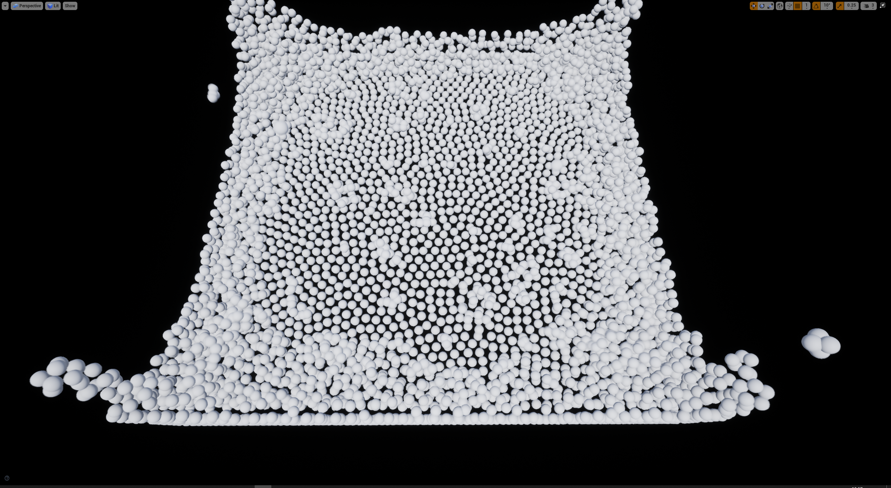
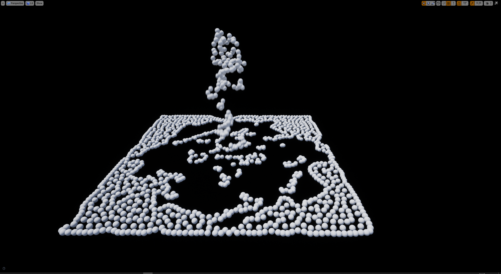
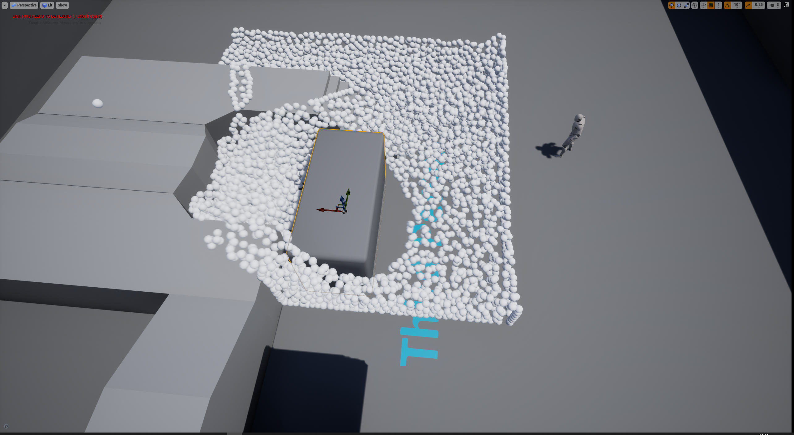

# Position Based Fluids

## 题目
**2.3.2  基于 3D 位置的流体模拟 (难度等级：2.5)**

## 视频
https://www.bilibili.com/video/bv1RR4y1H7Wj

## 图片

## 算法
### 伪代码
1: for all particles i do
2:	- apply gravity force $v_i$ ← $v_i$ + ∆tg
3:	- integrate $x^∗_i$ ← $x_i$ + ∆t$v_i$
4:	- find particle neighbors
5:	- calculate $λ_i$
6: end for
7: for all particles i do
8:	  - calculate $∆p_i$
9:	  - update position $x^∗_i$ ← $x^∗_i$ + $∆p_i$
10:	- handle boundary collisions
11:	- apply XSPH viscosity
12:	- update velocity $v_i$ ← $\frac{1}{∆t}$($x^∗_i$ − $x_i$)
13:	- update position $x_i$ ← $x^∗_i$
14: end for

### 公式
#### 密度约束
$C_i$($p_1$, ..., $p_n$) = $\frac{\rho_i}{\rho_0}$ - 1
$\rho_0$表示静止密度
$\rho_i$ = $\sum_jm_jW(p_i - p_j, h)$
W表示核函数，h为核半径，$m_j$表示粒子质量，此处我们架设所有粒子质量相同，后面的公式中将省略
$C(p + \Delta{p}) = 0$
我们希望求得$\Delta p$使得上式成立
$C(p + \Delta{p}) \approx C(p)$ + $\nabla{C^T}$$\nabla$C$\lambda$ + $\epsilon\lambda$
$\Delta{p} \approx \nabla{C}\lambda$
$\lambda_i$ = -$\frac{C_i(p_1, ..., p_n)}{\sum_k{\mid \nabla_{p_k}C_i \mid}^2 + \epsilon}$
要得$\Delta p$需要先求得$\lambda$，上式中$\epsilon$表示很小的实数，以防除零错误
$\nabla_{p_k}{C_i}$ = $\frac{1}{\rho_0}$$\begin{cases}\sum_j \nabla_{p_k}W(p_i - p_j, h)& \text{k = j}\\-\nabla_{p_k}W(p_i - p_j, h)& \text{k = j}\end{cases}$
当粒子为邻居时，计算其核函数的梯度；当为自身时，对所有邻居的梯度求和

#### 核函数
$W_{ij} = \frac{315}{64\pi h^9}(h^2 - r^2)^3$
核函数使用的是Poly6 kernel
$\nabla W_{ij} = -\frac{45}{\pi h^6}(h - r)^2$
而核函数的梯度函数使用的是Spiky kernel

#### 黏性
$v_i = v_i + c\sum_j v_{ij}W(p_i - p_j, h)$

#### 张力
$s_{corr} = -k\frac{W(p_i - p_j, h)^n}{W(\Delta q, h)}$
$\Delta p_i = \frac{1}{\rho0}\sum_j (\lambda_i + \lambda_j + s_{corr})\nabla W(p_i - p_j, h)$
一般取$\mid\Delta q\mid$ = 0.1h ... 0.3h, k = 0.1, n = 4

## 安装
- github地址：
https://github.com/zhanll/NiagaraFluid
- 安装4.26及以上版本UE4引擎，打开FluidSimulation.uproject即可